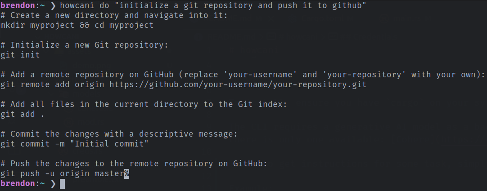

# howcani

A generative AI-powered CLI for getting step-by-step instructions for how to perform various tasks using the command line.

## Use

To install, ensure you have `cargo` on your system and run `cargo install howcani`.

The CLI requires a generative AI model as a backend to use for producing the instructions. As of now, there is only one available: [Cohere](https://cohere.com/).

Then, to get instructions for some task, simply run `howcani do "some task"`

Example:



## Credentials

Before using the CLI, you must set the credentials required for the chosen model--for Cohere, this is one API key. To add this key, run the `howcani creds add` with no arguments and paste your key when prompted. This will be stored in a toml file in your personal config directory (for example, on most Linux systems, the config file would be located at `/home/user/.config/howcani-creds.toml`).

Example:

```toml
cohere_api_key = "key"
```
